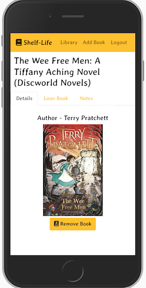
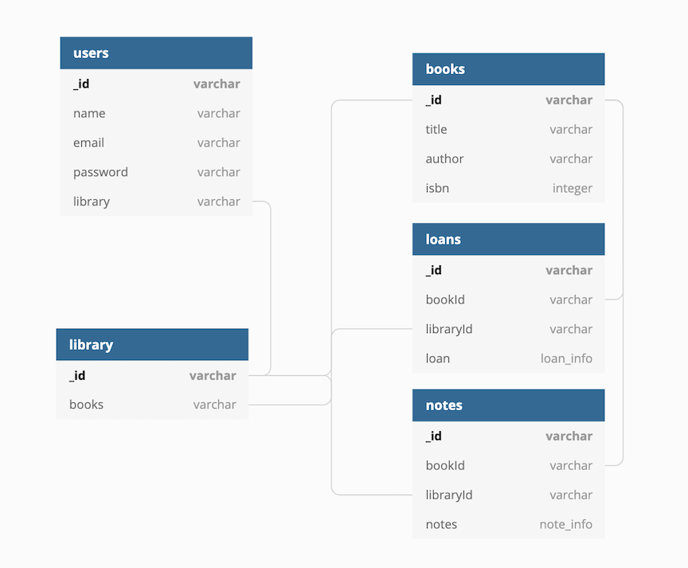
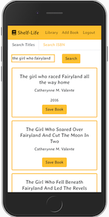
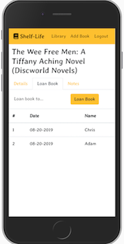

# Shelf Life

Browse your personal library, add new books, and keep track of who borrowed books when. Optimized for mobile first!

Check it out [here](https://enigmatic-springs-36434.herokuapp.com/)

## Resources

### APIs
- [Open Library Books API](https://openlibrary.org/dev/docs/api/books)

### Technologies Used
- React (Hooks)
- Typescript
- Node.js
- React Bootstrap
- Axios
- MongoDB

## Planning

I used a Trello board to manage tasks. Check it out [here](https://trello.com/b/FHCqVpD1/shelf-life) 

### Spec Sheet

### Models

### Routes
|METHOD| ROUTE| FUNCTION|
|:-----|:----:|:------:|
| POST | `/auth/signup` | creates a user profile and associated library |
| POST | `/auth/login` | logs user into profile, if alreacy created |
| POST | `/auth/me/from/token` | gets token from local storage, if present, and logs user in |
| GET  | `/api/library/:id` | gets user's library and all associated books |
| GET  | `/api/loan/:lid/:bid` | gets all loan data associated with a user's book |
| GET  | `/api/notes/:lid/:bid` | gets all notes associated with a user's book  |
| POST | `/api/library/book` | creates a book if new, and adds to a user's library |
| POST | `/api/library/loan`  | creates a record of a loan for a user's book  |
| POST | `/api/library/notes` | creates a note associated with a user's book  |
| PUT | `/api/library:id` | checks in a user's book that was loaned out |
| DELETE | `/api/library/:lid/:bid` | removes a book from a user's library |

## Thoughts

- Typescript was a challenge, particularly when integrating it into React with Hooks, to which I really only had a cursory introduction.  All the planning I did at the beginning helped a lot. In particular, I'm glad I sought help from a program manager on how to appropriately figure out specs.

- I rewrote a template that I already had in javascript into typescript. It was great for both a deeper understanding of the jwt authorization and setting me up to feel more comfortable writing the rest of the app in typescript.

- I started with the backend /api routes for GET and POST for libraries and books so I had something to start with, leaving space for the additional models to be added in later as the other got solidified. Coupled with the Trello board, I think that helped keep things under control. I didn't over extend and write more than I think I needed. It also meant that I didn't move on until things worked, so it limited where possible errors were coing from.

## Future Additions!
- [ ] A barcode reader! While not all books have their ISBN in the barcode, most books since 2001 do, so searching by taking a picture of the barcode and using the data to query the api would be amazing.
- [ ] Custom tagging of books. I have maybe 12 different versions of a kids book, being able to just find those by searching the library would be helpful
- [ ] User library searches. It would be interesting to search by book and see the libraries of other users that have the same books as you and what things they might have that you don't.

## Screenshots

      